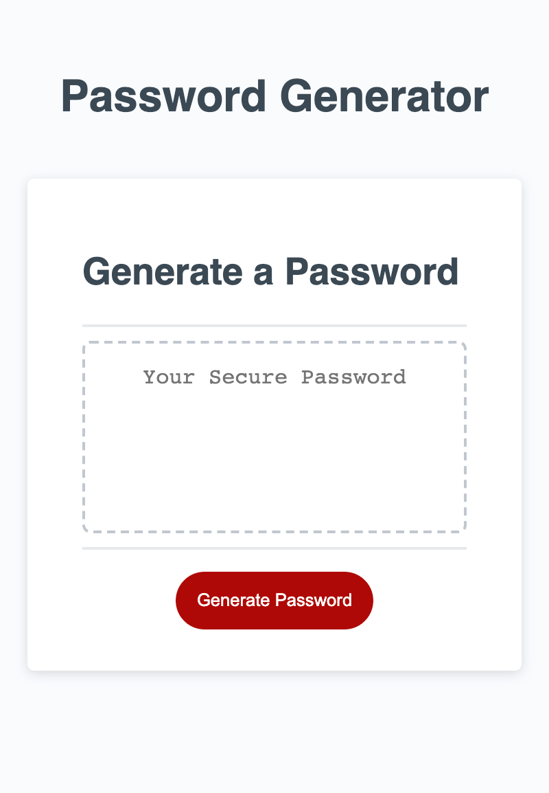

# Password Generator Starter Code

# Created a portfolio showcasing my works

# Made with HTML, CSS and JavaScript

# Creating a Password generator based on the criteria selected.

# Learned how to write the basics of JavaScript, writing functions and returning a password based on the user's criteria selected.

# 

# Ryan Dong

# Ryandong7@gmail.com

# Project Link: https://github.com/Arspeke8/AdvCSSProffesionalPortfolio
